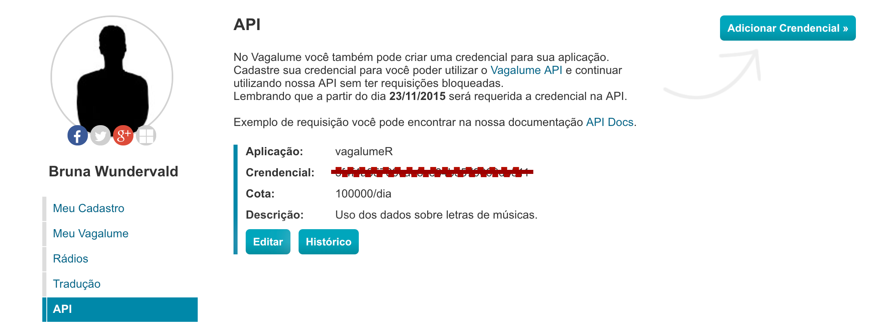

```{r setup, include=FALSE}
knitr::opts_chunk$set(echo = TRUE, 
                      warning = FALSE, 
                      message = FALSE,
                      cache = TRUE)
```


# Applications

Some _significant_ applications are demonstrated
in this chapter.


## Chords

`chorrrds` is a package to retrieve and analyse music data. It scrapes 
the [*Cifraclub*](https://www.cifraclub.com.br/) website to download and
organize music chords. Th package was created during my undergrad's 
thesis. In that work, I did an end-to-end analysis, exploring feature 
engineering techniques to describe and predict musical genres from music chord 
representation. In this section we will how to use the `chorrrds` 
functions and show some usage examples. 

### Installation

You can install `chorrrds` from your favourite CRAN mirror, simply running:

```{r, eval = FALSE}
install.packages("chorrrds")
```

You can also install the latest versios of `chorrrds` from the 
R-Music GitHub organization with:

```{r gh-installation, eval = FALSE}
# install.packages("devtools")
devtools::install_github("r-music/chorrrds")
```

### Functions

The main function of the package is called `get_chords()`. It
extracts music chords from an specific artist. There is two 
steps to obtain the data:

  1. Extraction of song urls for each music of an artist with `get_songs`.
  2. Extraction of music chords using the urls with `get_chords`.

```{r, warning=FALSE, results='asis'}
library(tidyverse) 

songs <- "janis-joplin" %>% 
  chorrrds::get_songs() 
```

At this point, the `chorrrd` object contains the url to be accessed via
webscraping and the name of each song. Next, we actually extract their
music chords with the `get_chords` function:

```{r, warning=FALSE, results='asis', cache = TRUE}

chords <- songs %>%   
  dplyr::pull(url) %>%                     
  purrr::map(chorrrds::get_chords) %>%     # Mapping the function over the 
                                           # selected urls
  purrr::map_dfr(dplyr::mutate_if, is.factor, as.character)   %>% 
  chorrrds::clean(message = FALSE)         # Cleans the dataset, in case
                                           # strange elements, as music lyrics, 
                                           # are present when they shouldn't

```


```{r, warning=FALSE, results='asis', cache = TRUE, echo = FALSE}
chords %>% slice(1:10) %>% knitr::kable()
```

The table above shows us how are the results of the `get_chords`
function. As we can see, the data is in a long format: the chords 
appear in the sequence they are in each music, being repeated
sometimes. The `music` column contains the name of the artist
and the name of the song. This can be changed if preferred, 
with: 

```{r}
chords <- chords %>% 
  tidyr::separate(music, c("artist", "music"), 
                  sep = "(?<=joplin) ", extra = "merge")

```

```{r, warning=FALSE, results='asis', cache = TRUE, echo = FALSE}
chords %>% slice(1:10) %>% knitr::kable()
```


### Data

There are many datasets that already come with the package. They were
used in the undergrad thesis, so it was a choice just to keep it 
in the package. The data is composed of several Brazilian artists
music chords. You can check the available datasets with the 
code above, which will not be run here because the results 
are long: 

```{r, eval = FALSE}
library(chorrrds)
ls("package:chorrrds")                 
```


### Use case

Returning to the data we collected before, let us explore it a little. 
The first thing we can look at is the most common chords in 
each music. Which are the common chords in music made
by Janis Joplin? Are the proportions of these chords
similar between the songs? 

```{r}
percentages <- chords %>% 
  dplyr::group_by(music) %>% 
  dplyr::count(chord) %>%
  dplyr::top_n(n, n = 3) %>%
  dplyr::mutate(prop = scales::percent(n/sum(n))) 
```

```{r, warning=FALSE, results='asis', cache = TRUE, echo = FALSE}
percentages %>%  knitr::kable()
```

With the dataset analyzed here, we can already
obtain some interesting information. For some songs, 
as the first and second pieces, the 3 most common chords 
appeared in a close proportion. For others,
this happens in a different way. Both the proportions and
the absolute quantities of the chords vary more.
That shows us that the structure of her songs 
don't follow a closed pattern, which can be a sign of how 
creative the artist was. 

We can also look at something called "chord bigrams". This
is pretty much the task of creating pairs of chords that 
happened in sequence, by music, and analyze their frequencies. 

```{r}
chord_bigram <- chords %>%
  dplyr::group_by(music) %>% 
  tidytext::unnest_tokens(bigram, chord, to_lower = FALSE,
                          token = "ngrams", n = 2) %>% 
  dplyr::count(bigram) %>% 
  dplyr::top_n(n, n = 2) 
```


```{r, warning=FALSE, results='asis', cache = TRUE, echo = FALSE}
chord_bigram %>%  knitr::kable()
```

There are some bigrams that happen many times in a song, while 
others just a few times, but are still the most frequent ones. In 
the song called "Piece of my heart", we have the repetition
of the chord "B", which is described by the appearance of 
the "B B" bigram. More of what we can find with this format of data
can be found in the next section of this book.

## Lyrics

The [`vagalumeR`](https://github.com/r-music/vagalumeR)  package 
provides us with access to the [Vagalume](https://www.vagalume.com.br/)
website API. [Vagalume](https://www.vagalume.com.br/) is a music 
portal, and its API has information about discographies, 
music names, related artists, and the most important one, **music lyrics**.

The first version of the package goes back to 2017 when I was 
taking a Text Mining course. For the course assignments, 
we were asked to deliver some interesting analysis using text and
the techniques we learned. As by that time I did not found anything 
related to music lyrics datasets, I made the package to solve this problem.

### How to get the API key

We are going to start by explaining how to get the *API key* .
You will need to be aware that [Vagalume](https://www.vagalume.com.br/)
is a **Brazilian** website, so everything there will be in Portuguese. 
The following explains how to go through that barrier and successfully get the key.  

1. Access https://auth.vagalume.com.br/ and log in (it can be done
with some social media account in the "Entre com" buttons):

```{r, results=TRUE, echo = FALSE}
knitr::include_graphics("img/login.png")
```


2. Go to https://auth.vagalume.com.br/settings/api/ and create an application:
  - Click on the "Adicionar Credencial" button and fill the name
  ("Nome da aplicação") and its purpose ("Descrição da aplicação"). Click
  "Cadastrar" to create it. 
  
3. Now you must have an API key available for use. In 
https://auth.vagalume.com.br/settings/api/, copy your
key from the "Credencial" section:


```{r, results=TRUE, echo = FALSE}

```

And there you have it. Now it is just a matter of having your key
stored in an object, ready to be used when needed:

```{r}
key <- "your-api-key"
```

```{r, echo = FALSE}
key <- readRDS("key_vag.rds")
```

The `vagalumeR` package has 6 main functions:

  - `artistInfo()`: brings us information about an specific artist.
  - `discography()`: gives us the discography of an artist.
  - `relatedInfo()`: brings us information about related artists 
  of one specific musician/band.
  - `genre()`: finds the music genre (or genres) of the artist.
  - `albums()`: finds the albums of the artist.
  - `songNames()`: gives us the names for the songs of an artist. 
  - `topLyrics()`: tells us about the top acessed lyrics of an artist.
  - `lyrics()`: brings the full lyrics and translation (when available)
  of the songs!
  
  

For today's post, we will be working with the band called 
[Belle and Sebastian](https://belleandsebastian.com/). I personally like
the band style and their lyrics, which can be taken as very poetic 
sometimes. The installation of the package is done with: 

```{r, eval = FALSE}
# install it either from 
# CRAN
install.packages('vagalumeR')
# or github
devtools::install_github("r-music/vagalumeR")
# checking the help of the package
help(package = "vagalumeR")
```


The lyrics obtention process needs two things: an artist, for who
we will first get the name of the songs, and the song ids. The code 
is as follows:

```{r}
library(tidyverse) # always
library(vagalumeR) # loading the package!

# defining the artist 
artist <- "the-white-stripes"

# Firt, obtaining the song names 
song <- songNames(artist)

# Mapping the lyrics function over the ids found
lyrics_data <- song %>% 
  dplyr::pull(song.id) %>% 
  purrr::map(lyrics, 
             artist = artist,
             type = "id", 
             key = key) %>%
  purrr::map_df(data.frame) 


glimpse(lyrics_data) 
```

Now we have our artists id and name, the songs names and ids, 
their language (2 for English and 1 for Portuguese!), the original
lyrics and the translation, when available. But that it's not the
only functionality of the `vagalumeR` package. The function below
gives us the information about the artist: 

```{r}
art_info <- vagalumeR::artistInfo(artist) 
```

```{r}
art_info %>%  knitr::kable()
```

Those information represent the position of the artist (column `pos`)
in a certain period (column `period`). There is also information about
how many views (column `unique`) the artist had how many
unique users (column `unique`) accessed the artist, as well
as their [Vagalume Ranking](https://www.vagalume.com.br/top100/artistas/geral/)
pontuation, that can either increase or decrease in the period. The
artist's genre, on the other hand, is extracted with an specific
function, once there can be a multiple categorization instead of just one
music genre:

```{r}
genre <- vagalumeR::genre(artist) 
```

```{r}
genre %>%  knitr::kable()
```

And names of the top lyrics for the artists can be found with: 

```{r}
top_lyr <- vagalumeR::topLyrics(artist)
```

```{r}
top_lyr %>%  knitr::kable()
```

This table represents their mos popular songs in the Vagalume
website. Information about the albums of an artist is also available
in the API, and we access it with:

```{r}
albums <- vagalumeR::albums(artist)
```

```{r}
albums %>%  knitr::kable()
```

We can also check the information about related/similar
bands and artists, with the `relatedInfo` function: 

```{r}
rel_info <- vagalumeR::relatedInfo(artist)
```

```{r}
rel_info %>%  knitr::kable()
```

That last table is the type of data that will later allow us to create 
networks between the artists, for example. In summary, the 
`vagalumeR` package can be used to extract a lot of important features
about the musicians, and we will explore the data in the next section. 


## Acessing the Spotify API

## Tablatures

## Audio
